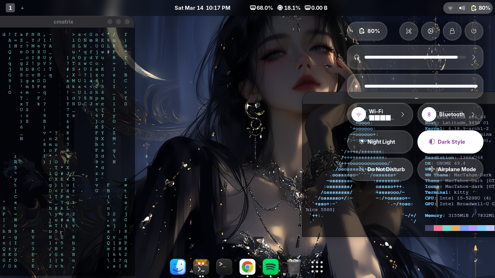

<p align="center">
  
</p>

<h1 align="center"></h1>

<p align="center">
  One command. A complete desktop transformation.
</p>

<p align="center">
  
  
  
  
  
</p>

---

<p align="center">
  
</p>

---

## What It Does

A single automated script that builds a fully customized GNOME desktop from scratch — no manual tweaking, no dependency hunting.

| Feature | Details |
|---|---|
| 🎨 **Theming** | Shell, GTK, icons, cursor, wallpaper |
| 🔎 **Launcher** | Ulauncher with custom theme |
| 🪟 **Effects** | Magic Lamp animations + Compiz-style transitions |
| 🚀 **Dock** | Dash-to-Dock, pre-tuned for productivity |
| 🌫 **Blur** | Blur-My-Shell with high-performance mode |

All applied automatically. No manual steps.

---

## Quick Start

> **Requires:** GNOME 42+, any fresh Linux install, and `git`.  
> ⚠️ **This overwrites existing GNOME extensions, themes, and keybindings.** Back up first — [Timeshift](https://github.com/linuxmint/timeshift) recommended.

```bash
git clone https://github.com/wtfenzo/GNOME-RICE.git
cd GNOME-RICE
chmod +x install.sh && ./install.sh
```

**For modern hardware / dedicated GPU** — enables full Blur-My-Shell:

```bash
./install.sh --full
```

After install, **log out and back in** to apply all changes.

---

## Post-Install

Fine-tune your setup anytime using:
- **GNOME Extensions** — toggle or configure individual extensions
- **GNOME Tweaks** — fonts, animations, titlebar behavior

---

## Issues

Something broke? [Open an issue](https://github.com/wtfenzo/GNOME-RICE/issues) and include:
- Your distro + GNOME version
- Error output (if any)

---

<p align="center">Built by <strong>iTachi</strong> — making GNOME ricing accessible to everyone.</p>